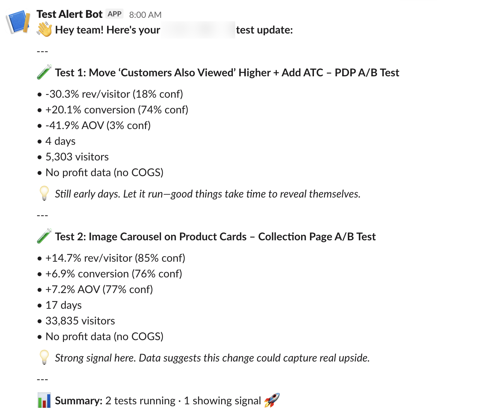
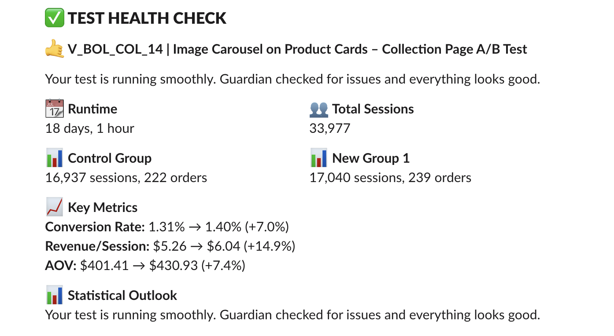

# Intelligems Skills for Claude Code

A collection of Claude Code skills for Intelligems A/B testing automation.

## Installation

```bash
npx skills add Victorpay1/intelligems-plugins
```

This installs all 3 skills. After installing, **restart Claude Code** to load the new skills.

### Install individual skills

```bash
npx skills add Victorpay1/intelligems-plugins/skills/agency-digest-setup
npx skills add Victorpay1/intelligems-plugins/skills/test-health-check-setup
npx skills add Victorpay1/intelligems-plugins/skills/intelligems-segment-analysis
```

## Available Skills

### intelligems-segment-analysis

Analyze which audience segments each active experiment is winning in.

**Shows:**
- Device type breakdowns (Desktop, Mobile, Tablet)
- Visitor type (New vs Returning)
- Traffic source (Paid Search, Organic, Direct, etc.)

**Example output:**

```
======================================================================
  Homepage Price Test
   Runtime: 21 days | Visitors: 45,000 | Orders: 320
======================================================================

📱 BY DEVICE
╭─────────┬──────────┬────────┬───────────┬─────────────┬──────────┬────────────╮
│ Segment │ Visitors │ Orders │ Variation │ Status      │ RPV Lift │ Confidence │
├─────────┼──────────┼────────┼───────────┼─────────────┼──────────┼────────────┤
│ Mobile  │   32,000 │    180 │ +5%       │ Doing well  │ +12.3%   │ 87%        │
│ Desktop │   13,000 │    140 │ +5%       │ Inconclusive│ +4.2%    │ 62%        │
╰─────────┴──────────┴────────┴───────────┴─────────────┴──────────┴────────────╯
```

**Usage:**

```
/intelligems-segment-analysis
```

---

### agency-digest-setup

Set up automated daily Slack digests for Intelligems A/B tests across multiple brands.

**Perfect for agencies because:**
- One message per brand (ready to forward to clients)
- Shows the metrics that matter (rev/visitor, profit/visitor, conversion, AOV)
- Health status at a glance (which tests need attention)
- No more logging into multiple accounts every morning

**Example output:**



**Usage:**

```
/agency-digest-setup
```

The setup wizard will guide you through:
1. Slack webhook configuration
2. Brand names and API keys
3. Daily schedule preferences
4. Test message verification

---

### test-health-check-setup

Set up automated daily Slack health checks for Intelligems A/B tests. Based on [Jerica's tutorial](https://docs.intelligems.io/developer-resources/external-api/build-an-automated-test-monitoring-integration-for-slack).

**Perfect for single brands because:**
- One message per test (detailed health status)
- Alerts when tests need attention (conversion drops, low traffic)
- Clear statistical outlook for each test
- Simpler setup than agency-digest (one API key only)

**Example output:**



**Usage:**

```
/test-health-check-setup
```

The setup wizard will guide you through:
1. Slack webhook configuration
2. Your Intelligems API key
3. Optional threshold customization
4. Daily schedule preferences
5. Test message verification

---

## Which skill should I use?

| Feature | segment-analysis | agency-digest | test-health-check |
|---------|------------------|---------------|-------------------|
| Purpose | Segment insights | Daily summary | Health monitoring |
| Brands | Any | Multiple | Single |
| Output | CLI table | Slack message | Slack message |
| Schedule | On-demand | Daily | Daily |
| Best for | Finding winners | Agencies | Individual merchants |

## Requirements

- Claude Code (Pro, Max, Teams, or Enterprise)
- Intelligems API key(s) - contact [support](https://portal.usepylon.com/intelligems/forms/intelligems-support-request)
- For digest skills: A Slack workspace with webhook access
